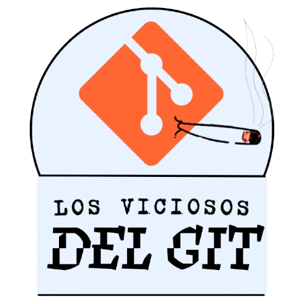

# Proyecto Grupal SCESI

# Los Viciosos del Git


 
**Integrantes:**
- DEV1 —  — Carlos Andres Sarzuri Calizaya -> Chambeador
- DEV2 —  — Gabriel Paredes Sipe -> Chambeador
- DEV3 —  — Benjamin Alex Quiroga Pérez -> Chambeador
- DEV4 — — Andrea Coca Pereira - No Chambeo
 
## Descripcion
Sitio web del grupo Los Viciosos del Git.
El proyecto grupal del curso de GIT de la SCESI 2026.
 
## Estructura
proyecto_grupal_scesi/

  assets/css/index.css

  assets/html/nosotros.html --> Equipo

  assets/html/top.html --> Top comandos Git

  assets/html/sugerencias.html --> Formulario de contacto

  assets/icons/logo_git-background.ico

  assets/imgs/logo_git-background.png

  assets/imgs/logo_git.png

  index.html

  README.md
 
## Como correr el proyecto

Ingresamos al navegador y ingresamos la URL

 ```
 https://sarzuricarlos.github.io/proyecto_grupal_scesi/
 ```

## Flujo de trabajo
Gitflow — develop + feature/* + hotfix/* + release/*

### Mensajes de Agradecimiento 

Queremos agradecer a la cafeina por habernos dado la energia para completar este proyecto, sin ella no seriamos nada y a la comunidad de Git por ser tan genial y ayudarnos a aprender esta herramienta tan importante para el desarrollo de software.